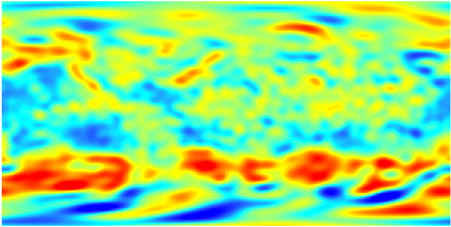
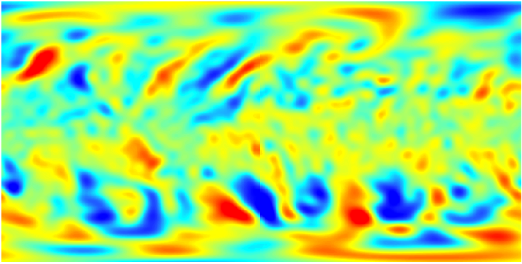
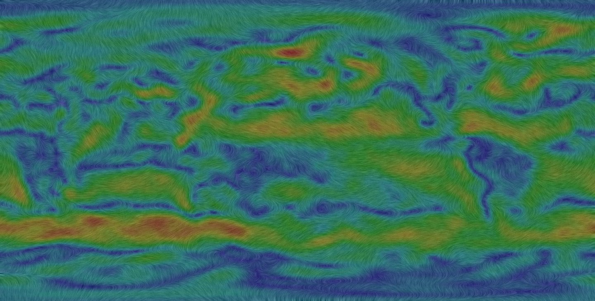

# Introduction

This is an application to generate a windmap image based on uwnd and vwnd data files from NOAA. It's built on Microsoft Visual Studio 2015.

The uwnd and vwnd data files can be downloaded from this [website](https://www.esrl.noaa.gov/psd/repository/entry/show?entryid=e18f0d6f-743f-42ff-8aad-0e152357641b). The uwnd file records the wind speed in the direction of longitude, while the vwnd file in the direction of latitude. The wind data is a NetCDF file. Converting it to TIFF or Reading it directly using GDAL is up to you.


# Thirdparties

GDAL, OpenCV, tinycolormap and cmdline are used int this application.

[GDAL](https://github.com/OSGeo/gdal): An open source X/MIT licensed translator library for raster and vector geospatial data formats. 

[OpenCV](https://github.com/opencv/opencv): An open source computer vision library.

[tinycolormap](https://github.com/yuki-koyama/tinycolormap)： A header-only, single-file library for colormaps written in C++11.

[cmdline](https://github.com/tanakh/cmdline): A simple command line parser for C++.


# Useage

Enter command line in the directory where the program is located. 

Follow the instruction below:

```
usage: VectorFieldVis.exe --uwnd=string --vwnd=string --output=string
options:
  -u, --uwnd      uwnd    file path (string)
  -v, --vwnd      vwnd    file path (string)
  -o, --output    output  file path (string)
```

# Example

Some uwnd file convereted to TIFF format:


And some vwnd file:


Windmap image generated:



